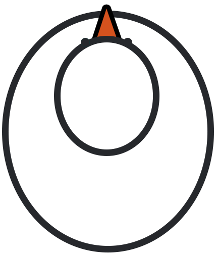

<div id="top"></div>

<!-- PROJECT SHIELDS -->
<!--
*** I'm using markdown "reference style" links for readability.
*** Reference links are enclosed in brackets [ ] instead of parentheses ( ).
*** See the bottom of this document for the declaration of the reference variables
*** for contributors-url, forks-url, etc. This is an optional, concise syntax you may use.
*** https://www.markdownguide.org/basic-syntax/#reference-style-links
-->


<!-- PROJECT LOGO -->
<br />
<div align="center">



<h3 align="center">Goose Chase</h3>

<p align="center">A Simple Python-based Game using Hand Detection</p>

  <p align="center">
    <br />
    <a href="#">Demo</a>
    ·
    <a href="https://github.com/LynnHaDo/Goose-Catching/issues">Report Bug</a>
    ·
    <a href="https://github.com/LynnHaDo/Goose-Catching/issues">Request Feature</a>
  </p>
</div>

<!-- TABLE OF CONTENTS -->
<details>
  <summary>Table of Contents</summary>
  <ol>
    <li>
      <a href="#about-the-project">About The Project</a>
      <ul>
        <li><a href="#features">Features</a></li>
        <li><a href="#built-with">Built With</a></li>
      </ul>
    </li>
    <li>
      <a href="#getting-started">Getting Started</a>
    </li>
    <li><a href="#works-cited">Works Cited</a></li>
    <li><a href="#contact">Contact</a></li>
  </ol>
</details>

<!-- ABOUT THE PROJECT -->
## About The Project

A lot of this app is inspired by [this repository](https://github.com/mohamedamine99/Ninja-Fruit-Like-Game-with-hand-gesture-and-opencv/tree/main), which essentially simulates the ninja fruit game. But instead of the tablet or phone screen, users will interact through the web camera and 
"catch" the fruits (or geese in this case) using the movement of the index finger. 

What this app hopes to achieve is introducing an easy-to-implement way of integrating computer vision tools to beginners to Computer Science. It also attempts to design the code in an OOP way, which helps with maintainability, reusability and readability. 

<p align="right">(<a href="#top">back to top</a>)</p>

### Progress

- [x] Set up project's backlog
- [x] Integrate MediaPipe
    - [x] Hand landmarks are visualized as the camera runs 
    - [x] The tip of the index finger is highlighted as it moves. 
- [x] Finish the main functionalities
    - [x] Finish `Goose` implementation
    - [x] Finish `Game` implementation 
        - [x] Render goose images on the window playground at a specific rate
        - [x] Keep track of events as the camera continues to run 
            - [x] Decrease score as a goose cross the border.
                - [x] The game ends when the number of lives is 0. 
            - [x] Increase score as the tip of the index finger reaches a goose 
            - [x] Level up as the score passes a threshold. 
                - [x] Increase the rate by which the geese are generated 
                - [x] Increase the speed of the geese 

See the [open issues](https://github.com/LynnHaDo/Goose-Catching/issues) for a full list of proposed features (and known issues).

<p align="right">(<a href="#top">back to top</a>)</p>

### Built With

- Python 3.12.5
- [MediaPipe API Hand Landmark](https://ai.google.dev/edge/mediapipe/solutions/vision/hand_landmarker/python)

- [OpenCV 4.10.0.84](https://docs.opencv.org/4.10.0/)
- [Numpy 1.26.4](https://numpy.org/doc/stable/release/1.26.4-notes.html)

Please view the complete list of libraries and packages in `requirements.txt`.

<p align="right">(<a href="#top">back to top</a>)</p>

<!-- GETTING STARTED -->

## Getting started

1. Clone the repo

```
git clone https://github.com/LynnHaDo/GestureVerse.git
```

According to the [Windrift repo](https://github.com/lizadaly/windrift?tab=readme-ov-file):

2. Install a fully-compaticble version of Node:

```
nvm install 18
nvm use 18
```

3. Install packages

```
npm install
```

4. Run the local development environment

```
npm run dev
```

<p align="right">(<a href="#top">back to top</a>)</p>

<!-- Works cited -->
## Works cited

1. Github Repo by mohamedamine99 (https://github.com/mohamedamine99/Ninja-Fruit-Like-Game-with-hand-gesture-and-opencv)

2. OpenCV 

```
@article{opencv_library,
    author = {Bradski, G.},
    citeulike-article-id = {2236121},
    journal = {Dr. Dobb's Journal of Software Tools},
    keywords = {bibtex-import},
    posted-at = {2008-01-15 19:21:54},
    priority = {4},
    title = {{The OpenCV Library}},
    year = {2000}
}
```

3. Numpy 

```
@Article{         harris2020array,
 title         = {Array programming with {NumPy}},
 author        = {Charles R. Harris and K. Jarrod Millman and St{\'{e}}fan J.
                 van der Walt and Ralf Gommers and Pauli Virtanen and David
                 Cournapeau and Eric Wieser and Julian Taylor and Sebastian
                 Berg and Nathaniel J. Smith and Robert Kern and Matti Picus
                 and Stephan Hoyer and Marten H. van Kerkwijk and Matthew
                 Brett and Allan Haldane and Jaime Fern{\'{a}}ndez del
                 R{\'{i}}o and Mark Wiebe and Pearu Peterson and Pierre
                 G{\'{e}}rard-Marchant and Kevin Sheppard and Tyler Reddy and
                 Warren Weckesser and Hameer Abbasi and Christoph Gohlke and
                 Travis E. Oliphant},
 year          = {2020},
 month         = sep,
 journal       = {Nature},
 volume        = {585},
 number        = {7825},
 pages         = {357--362},
 doi           = {10.1038/s41586-020-2649-2},
 publisher     = {Springer Science and Business Media {LLC}},
 url           = {https://doi.org/10.1038/s41586-020-2649-2}
}
```

3. MediaPipe Python Hand Landmark APIs (https://mediapipe.readthedocs.io/en/latest/getting_started/python.html)

<p align="right">(<a href="#top">back to top</a>)</p>